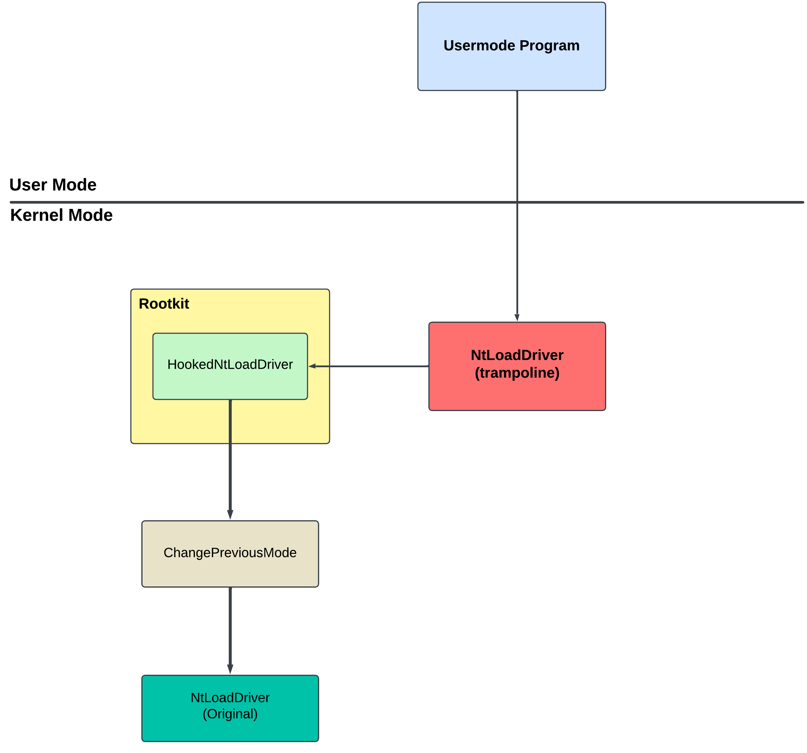

## Overview

This project demonstrates SSDT Hooking on Windows 11 by intercepting calls to NtLoadDriver. Dynamically using the address of the SSDT, the address of the NtLoadDriver is calculated by the rootkit and places a trampoline at the original address. After calling NtLoadDriver, the usermode program is redirected through this trampoline to the rootkit's function.

Then, the rootkit  sets the PreviousMode flag as kernel mode and writes the usermode program parameter to kernel memory and it removes the trampoline it added to NtLoadDriver. Finally loads the driver. 

## `🔍` Research
