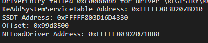

## Overview

This project demonstrates SSDT Hooking on Windows 11 by intercepting calls to NtLoadDriver. Dynamically using the address of the SSDT, the address of the NtLoadDriver is calculated by the rootkit and places a trampoline at the original address. After calling NtLoadDriver, the usermode program is redirected through this trampoline to the rootkit's function.

Then, the rootkit  sets the PreviousMode flag as kernel mode and writes the usermode program parameter to kernel memory and it removes the trampoline it added to NtLoadDriver. Finally loads the driver. 

If you want to take a look at the detailed description of the project, you can check out [this medium article](https://medium.com/@0xbekoo/loading-driver-from-user-mode-program-via-ssdt-hooking-720eeb08abb9).

> [!Warning]
> Please note that the content of this repository is intended for educational purposes only. I do not endorse or encourage any illegal activities. The techniques and methods demonstrated here should not be used for malicious purposes or in any unauthorized scenarios.

## `🔧:` Running The Project

> [!Note]
> To test the project, you need to prepare your virtual machine as test mode.

First of all, the project has been prepared for the following Windows version:

- **Version: Windows 11 24H2**
- **OS Build: 26100.2894**

The latest version of Windows 11 would be better to try this project. When you are ready for debugging, first run the driver and check the results as below:

  

 

You can then run the User-Mode program to see the results.
